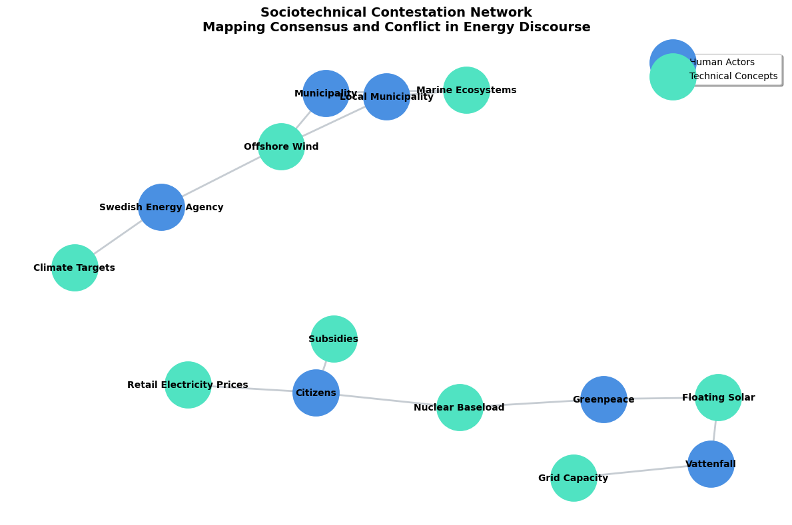

# Sociotechnical Discourse Network Analyzer (DNA)
**A Computational Proof of Concept for Mapping Consensus and Conflict in Energy Transitions**

## Abstract: Operationalizing STS Methodology
This repository contains a Python-based pipeline designed to empirically map the political dynamics and sociotechnical friction of the energy transition. 

Traditional qualitative methodologies in Science and Technology Studies (STS)—such as ethnographic fieldwork or human-subject interviews—frequently encounter bottlenecks regarding observer bias, social performance, and scalability. To address the research parameters of mapping *Consensus and Conflict* in energy policy, this project bypasses human-centric data collection. Instead, it deploys a computational Discourse Network Analysis (DNA) to treat institutional texts, policy drafts, and corporate reports as the primary sites of sociotechnical contestation.

## The Engineering Architecture
The pipeline is contained within a single, reproducible Jupyter Notebook (`Consensus_Conflict_DNA_PoC.ipynb`). It integrates NLP extraction with graph mathematics to quantify qualitative discourse.

1. **Unstructured Data Ingestion:** Extracts raw text payloads from institutional PDFs and policy documents.
2. **Generalized Symmetry in NLP (`spaCy`):** Standard Named Entity Recognition (NER) models are biased toward human organizations. This pipeline utilizes a custom, rule-based extraction heuristic that enforces the STS principle of generalized symmetry—identifying and extracting both human actors (e.g., *Vattenfall*, *Swedish Energy Agency*) and non-human technical artifacts (e.g., *Offshore Wind*, *Grid Capacity*) with equal analytical weight.
3. **Topological Mapping (`NetworkX`):** Transposes linear text into a bipartite network matrix. It calculates Degree Centrality and Eigenvector Centrality to mathematically identify which technical concepts or actors function as "obligatory passage points" driving the policy conflict.

## Relevance to Doctoral Research (REF 2026-0103)
This Proof of Concept (PoC) demonstrates the immediate technical capacity to execute the methodological requirements for the Chalmers doctoral position. It provides a scalable, programmable framework for:
* **Discourse Network Analysis:** Moving beyond manual coding to programmatically map actor-concept relations at scale.
* **Quantitative/Qualitative Text Analysis:** Transforming unstructured political rhetoric into measurable network topology.
* **Isolating Mechanisms of Conflict:** Visually and mathematically identifying the exact technologies and policies where consensus fractures among policymakers, firms, and citizens.

## Usage
The core logic and theoretical annotations are available in the accompanying Jupyter Notebook.
